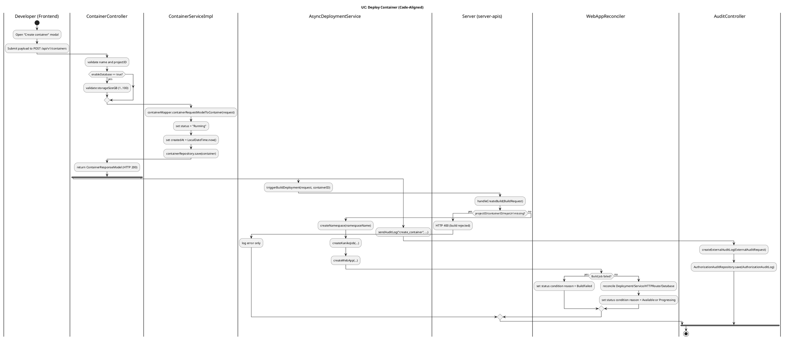
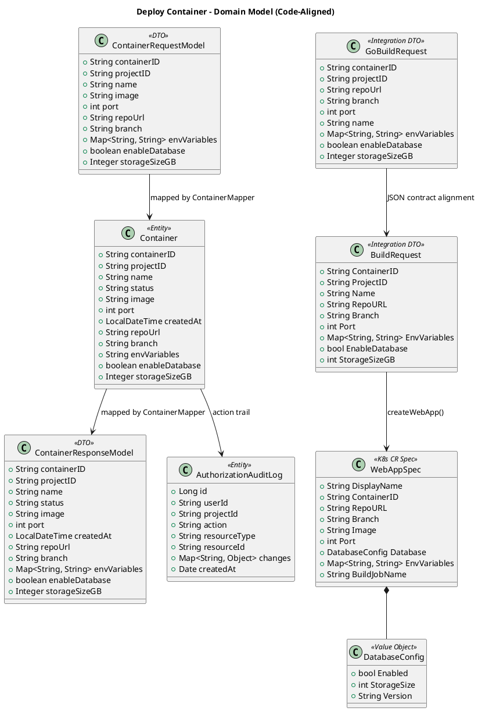
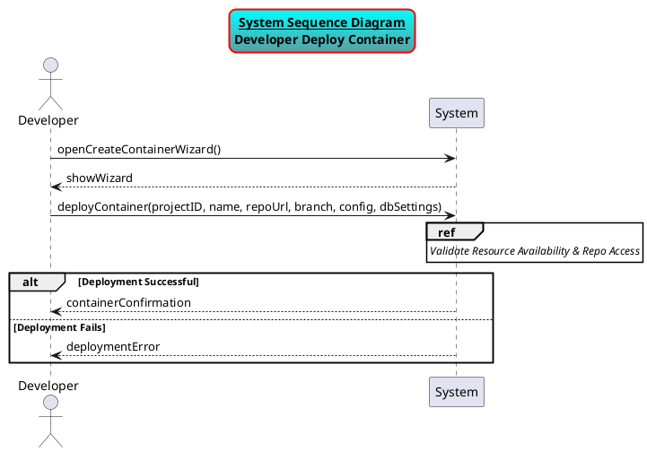
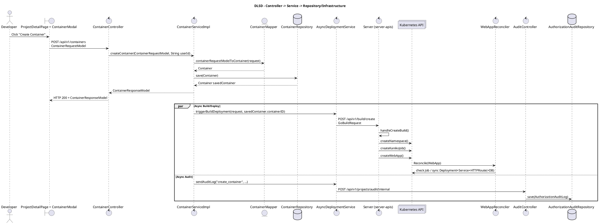
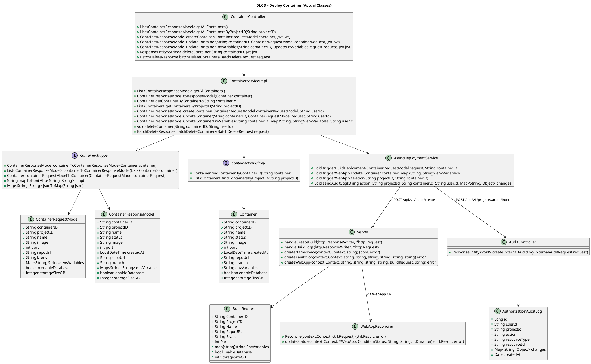
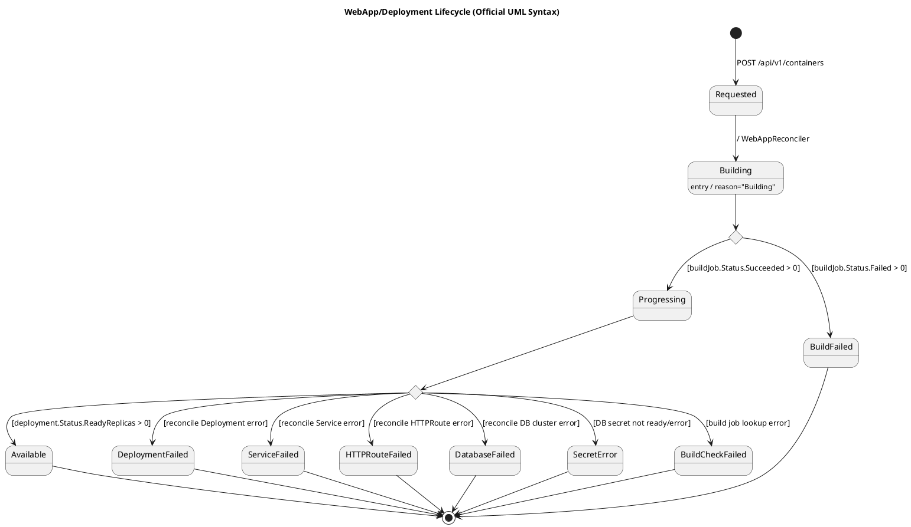

# Deploy Container Use Case Design Package (Kleff)

## Scope Note
This document is generated from the current codebase and aligns class names, method signatures, fields, and flows to implementation in:
- `deployment-service`
- `server-apis`
- `operator`
- `project-management-service`
- `frontend`

## 1. Use Case Definition & Requirements

### 1.1 Activity Diagram (PlantUML)

### 1.2 Fully Developed Use Case (FDUC)

- **Name:** Deploy Container
- **Scenario:** A user deploys a new containerized app from a Git repository into Kleff.
- **Triggering Event:** User clicks `Create Container` and submits the form in `ContainerModal`.
- **Primary Actor:** Authenticated Developer/Owner/Admin user.
- **Supporting Actors/Systems:** `ContainerController`, `ContainerServiceImpl`, `AsyncDeploymentService`, `Server` (`server-apis`), Kubernetes API, `WebAppReconciler`, `AuditController`.
- **Related UCs:**
1. UC-24 View Build Logs (`GET /api/v1/build/logs/{projectID}/{containerID}`)
2. Update Container (`PUT /api/v1/containers/{containerID}`)
3. Update Environment Variables (`PATCH /api/v1/containers/{containerID}/env`)
4. View Project Activity (`GET /api/v1/projects/{projectId}/activity`)
- **Stakeholders:** Platform users, SRE/ops, project owners, audit/compliance stakeholders.

- **Preconditions:**
1. Caller is authenticated (deployment-service security requires JWT on all non-health endpoints).
2. `projectID` and `name` are provided.
3. If `enableDatabase=true`, `storageSizeGB` is provided and between 1 and 100.
4. Upstream build/deploy services are reachable for end-to-end success.

- **Postconditions (Success path):**
1. A row is persisted in `containers` table.
2. Build/deploy orchestration is triggered asynchronously via `/api/v1/build/create`.
3. Audit event is sent to `/api/v1/projects/audit/internal`.
4. Operator reconciles `WebApp` to deployment resources and may mark condition `Available`.

- **Postconditions (Failure path):**
1. Container row may still exist even if build trigger or deployment fails (async failure is logged).
2. Audit log may be missing if audit call fails (also async and swallowed).

#### Flow of Activities (Actor vs System)

| Step | Actor | System |
|---|---|---|
| 1 | Opens project details and starts container creation | Shows `ContainerModal` wizard |
| 2 | Enters `repoUrl`, `branch`, `name`, `port`, `envVariables`, DB options | Builds `ContainerRequestModel` payload |
| 3 | Clicks Create | Sends `POST /api/v1/containers` |
| 4 |  | `ContainerController.createContainer(...)` validates request |
| 5 |  | `ContainerServiceImpl.createContainer(...)` maps and saves `Container` |
| 6 |  | `AsyncDeploymentService.triggerBuildDeployment(...)` dispatches `GoBuildRequest` |
| 7 |  | `Server.handleCreateBuild(...)` creates namespace, Kaniko job, and WebApp CR |
| 8 |  | `WebAppReconciler.Reconcile(...)` waits for build completion, then deploys |
| 9 |  | `AsyncDeploymentService.sendAuditLog(...)` posts audit event |
| 10 | Sees container appear | UI reloads containers and can open Build Logs sheet |
| 11 | Optionally checks activity log | Reads project activity fed from audit table |

#### Inclusions
- **UC-24 View Build Logs:** triggered via `BuildLogsSheet`/`BuildLogsViewer` using `/api/v1/build/logs/{projectID}/{containerID}`.
- **Audit Recording Inclusion:** `sendAuditLog(...)` -> `AuditController.createExternalAuditLog(...)`.

#### Extensions
- **EXT-1 (Database enabled):** if `enableDatabase=true`, deployment includes CloudNativePG cluster and DB env var injection.
- **EXT-2 (Update existing container):** `PUT /api/v1/containers/{containerID}` reuses build trigger flow.

#### Exceptions
- **EX-1 Validation failure:** empty `name`/`projectID`, or invalid DB storage -> runtime error mapped to `400`.
- **EX-2 Auth error:** missing/invalid JWT -> `401/403` from Spring Security before controller logic.
- **EX-3 Build trigger rejection:** server-apis rejects missing `repoUrl`/IDs (`400`) but deployment-service only logs async failure.
- **EX-4 Build failure:** operator sets condition reason `BuildFailed`.
- **EX-5 Audit service unavailable:** audit post fails and is logged; create endpoint still returns success.

### Alignment Explanation
- FDUC persistence steps map directly to `Container` entity lifecycle (`ContainerRequestModel` -> `Container` -> `ContainerResponseModel`).
- Build/deploy steps map to integration DTO chain (`GoBuildRequest` -> `BuildRequest` -> `WebAppSpec`).
- This sequence predicts SSD messages: create request, immediate acknowledgment, async build/deploy, and audit write.

## 2. Conceptual & Domain Level Modeling

### Domain Model (PlantUML)

### Alignment Explanation
- `Container` is the core persisted aggregate for deployment metadata.
- Persistence mapping:
1. `Container` -> table `containers`
2. `AuthorizationAuditLog` -> table `authorization_audit_logs`
3. `WebAppSpec` -> CRD `webapps.kleff.kleff.io`
- DTO consistency:
1. `ContainerRequestModel`/`ContainerResponseModel` mirror entity fields.
2. `ContainerMapper` converts `envVariables` map <-> JSON text.
3. frontend maps `containerID` to `containerId` in API adapter.

## 3. UI/UX Design

### Design Titles (for Figma)
1. **Project Detail - Running Containers**: container list, create button, status cards.
2. **Create Container - Step 1 Repository**: GitHub username/repo picker + `repoUrl`.
3. **Create Container - Step 2 Basic Info**: `name`, `branch`.
4. **Create Container - Step 3 Runtime Config**: `port`, key/value `envVariables`.
5. **Create Container - Step 4 Database**: `enableDatabase`, `storageSizeGB` slider.
6. **Build Logs Sheet**: streaming logs by `projectId` + `containerId`.
7. **Container Detail Modal**: deployed URL, branch, ports, source, env vars, DB status.
8. **Project Activity Modal**: action timeline including deployment/audit events.
9. **Edit Environment Variables Modal**: patch env vars for an existing container.

### Alignment Explanation
- `repoUrl` field -> `ContainerRequestModel.repoUrl` -> `GoBuildRequest.repoUrl` -> `BuildRequest.RepoURL` -> `WebAppSpec.RepoURL`
- `branch` field -> `ContainerRequestModel.branch` (defaults to `main` in `GoBuildRequest` if empty)
- `port` field -> `ContainerRequestModel.port` -> `BuildRequest.Port` -> `WebAppSpec.Port`
- env variables UI -> `Map<String,String>` -> `Container.envVariables` JSON -> `WebAppSpec.EnvVariables`
- DB toggle/slider -> `enableDatabase` + `storageSizeGB` -> `DatabaseConfig.Enabled` + `DatabaseConfig.StorageSize`
- Navigation: Project Detail -> Create Modal -> Save -> Build Logs -> Activity Log, matching FDUC sequence.

## 4. Interaction, Behavioral, and Logical Design

### 4.1 SSD (PlantUML)

### 4.2 DLSD (PlantUML)

### 4.3 DLCD (PlantUML)

### 4.4 STD (PlantUML)

### Alignment Explanation
- SSD messages map one-to-one to the FDUC core flow (submit, acknowledge, logs, activity).
- DLSD realizes SSD through concrete objects and method calls (`ContainerController` -> `ContainerServiceImpl` -> `ContainerRepository` + async integrations).
- Signatures and constraints supporting invariants:
1. `createContainer(ContainerRequestModel, Jwt)` validation of required fields and DB storage range.
2. `triggerBuildDeployment(ContainerRequestModel, String)` enforces container ID inclusion in upstream build request.
3. `validateAndSanitize(...)` in build manager enforces DNS-1123 safe identifiers.
- State constraints from operator reasons (`Building`, `BuildFailed`, `Available`) affect observable behavior and exception scenarios.

## 5. Implementation

### Key Files and Methods
1. `/Users/jeremy/Documents/www/frontend/src/features/projects/components/CreateContainerModal.tsx`
2. `/Users/jeremy/Documents/www/deployment-service/src/main/java/com/kleff/deployment/presentation/ContainerController.java`
3. `/Users/jeremy/Documents/www/deployment-service/src/main/java/com/kleff/deployment/business/ContainerServiceImpl.java`
4. `/Users/jeremy/Documents/www/deployment-service/src/main/java/com/kleff/deployment/business/AsyncDeploymentService.java`
5. `/Users/jeremy/Documents/www/server-apis/main.go`
6. `/Users/jeremy/Documents/www/operator/internal/controller/webapp_controller.go`
7. `/Users/jeremy/Documents/www/project-management-service/src/main/java/com/kleff/projectmanagementservice/presentationlayer/audit/AuditController.java`
8. `/Users/jeremy/Documents/www/frontend/src/features/projects/components/BuildLogsViewer.tsx`
9. `/Users/jeremy/Documents/www/frontend/src/features/projects/components/ActionLogModal.tsx`

### Current Gaps vs Ideal Design Requirements
1. Build/deploy errors are async and not returned to create caller.
2. `repoUrl` is not validated at deployment-service boundary before async call.
3. `Container.status` is optimistically set to `Running` and not synced from operator status reasons.
4. Generated deployment image is not persisted back into `Container.image`.
5. Local nginx routing has no `/api/v1/build/*` location, affecting build logs path.
6. External audit endpoint is `permitAll` and should rely on network controls / service auth hardening.

## Alignment Against 420-N61-LA Assessment Document

### What this document currently covers well
- Fully developed use case with flow, inclusions, extensions, exceptions.
- Domain model aligned to code and storage.
- UI field to domain mapping and flow alignment.
- SSD, DLSD, DLCD, STD with code-aligned names and signatures.
- Implementation mapping and gap analysis.

### What is still missing for full compliance with your assignment sheet
1. **Use Case Diagram artifact** (explicitly required by assessment; not included yet).
2. **C4 Level 1** (System Context) diagram.
3. **C4 Level 2** (Container Architecture) diagram.
4. **C4 Level 3** diagrams for all tiers (presentation, business, data/infrastructure).
5. **Figma prototype links/screenshots** embedded in the system document.
6. **Use Case Validation section with E2E mapping table**
   - each E2E test mapped to FDUC step
   - explicit alternate/exception path coverage matrix.
7. **Hyperlinked alignment explanations**
   - assignment asks explanations to include links to the referenced diagrams and figure numbering.

### Verdict
- **Short answer:** No, not 100% yet.
- **Accurate answer:** The generated package is strongly aligned for sections 1, 3, 4, and 5 of your assessment, but it is still **incomplete** for the full rubric until the Use Case Diagram, C4 L1/L2/L3 set, and E2E path-mapping validation section are added.

